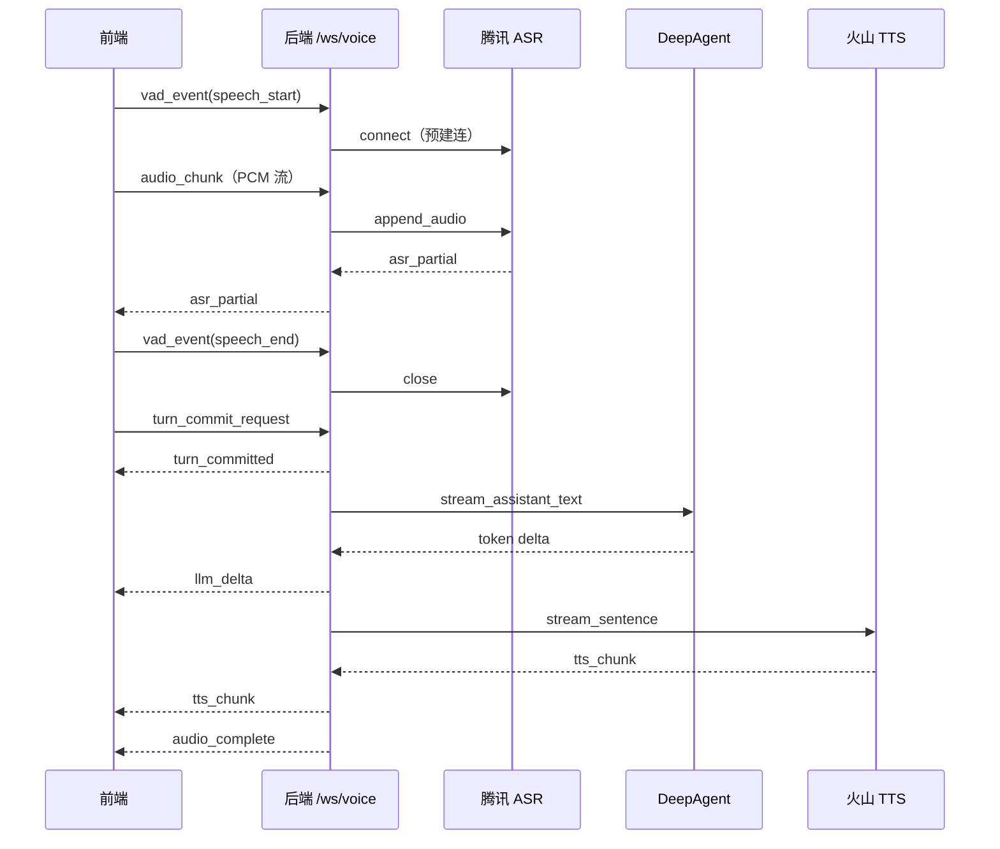

# 实时语音机器人

实时语音对话机器人：浏览器采集语音 → WebSocket 编排 → 腾讯 ASR 识别 → 火山方舟 DeepAgent 推理 → 火山 TTS 播报。

## 功能概览

| 能力 | 说明 |
|------|------|
| 语音采集 | Web Audio API，16k PCM，约 200ms 分片上行 |
| 端侧 VAD | `speech_start` / `speech_end`，自动提交本轮 |
| 实时 ASR | 腾讯实时语音识别；`speech_start` 预建连，避免 15s 空闲超时 |
| 流式 LLM | DeepAgent + Ark，`stream_mode=messages` 逐 token 输出 |
| 流式 TTS | 火山 v3 双向 WebSocket，按标点切段合成 |
| 打断 | `cancel` + `generation_id`，停止当前轮播报 |
| 前端 UI | ASR 字幕、助手回复打字机效果、对话区自动滚动 |

## 对话时序



## 架构

```
┌─────────────────────────────────────────────────────────┐
│  frontend/  React + Vite                                │
│  VoicePage · audioCapture(VAD) · TypewriterText         │
└──────────────────────────┬──────────────────────────────┘
                           │ ws://127.0.0.1:8000/ws/voice
┌──────────────────────────▼──────────────────────────────┐
│  backend/  FastAPI                                      │
│  voice_endpoint → orchestrator                          │
│    ├─ tencent_ws_client   (ASR)                         │
│    ├─ deepagent_runner    (Ark LLM, messages 流式)      │
│    └─ volcano_ws_client   (TTS)                         │
└─────────────────────────────────────────────────────────┘
```

## 目录结构

```
voice-robot/
├── backend/
│   ├── app/
│   │   ├── ws/voice_endpoint.py      # WebSocket 入口
│   │   ├── services/
│   │   │   ├── asr/tencent_ws_client.py
│   │   │   ├── agents/deepagent_runner.py
│   │   │   ├── orchestrator.py
│   │   │   └── tts/volcano_ws_client.py
│   │   ├── schemas/events.py         # 上行事件 Pydantic 模型
│   │   └── core/settings.py
│   ├── vendor/tencentcloud-speech-sdk-python/  # 腾讯 SDK（本地）
│   ├── tests/
│   └── .env.example
├── frontend/
│   └── src/
│       ├── pages/VoicePage.tsx
│       ├── audio/audioCapture.ts
│       ├── components/TypewriterText.tsx
│       └── ws/voiceSocket.ts
├── docs/
│   ├── protocol.md       # WebSocket 协议（权威）
│   ├── prd.md
│   └── qa-test-plan.md
└── README.md
```

## 环境要求

- **Python** >= 3.11
- **Node.js** >= 18
- 推荐 conda 环境：`voice-robot`
- 联调真实服务需：腾讯 ASR、火山 TTS、火山方舟 Ark 凭证

## 快速开始

### 1. 配置环境变量

```bash
cd backend
cp .env.example .env
```

编辑 `backend/.env`。本地开发可保持 `VOICE_ROBOT_MOCK_STREAMING_ENABLED=true`（不调用外部 ASR/TTS）。

### 2. 启动后端

```bash
cd backend
pip install -e ".[dev]"
uvicorn app.main:app --host 127.0.0.1 --port 8000
```

验证：

```bash
curl http://127.0.0.1:8000/healthz
# {"status":"ok"}
```

**重启后端（PowerShell）：**

```powershell
Get-NetTCPConnection -LocalPort 8000 -State Listen -ErrorAction SilentlyContinue |
  ForEach-Object { Stop-Process -Id $_.OwningProcess -Force -ErrorAction SilentlyContinue }
Set-Location backend
uvicorn app.main:app --host 127.0.0.1 --port 8000
```

**重启后端（Bash）：**

```bash
fuser -k 8000/tcp 2>/dev/null || lsof -ti:8000 | xargs kill -9 2>/dev/null
cd backend && uvicorn app.main:app --host 127.0.0.1 --port 8000
```

### 3. 启动前端

```bash
cd frontend
npm install
npm run dev
```

打开 http://127.0.0.1:5173 ，点击 **开启语音**。WebSocket 默认：`ws://127.0.0.1:8000/ws/voice`。

## 运行模式

| 模式 | 配置 | 行为 |
|------|------|------|
| Mock（默认单测） | `MOCK_STREAMING_ENABLED=true` | ASR/TTS/LLM 走本地 mock，无需外网密钥 |
| 联调 | `MOCK_STREAMING_ENABLED=false` + 填齐凭证 | 真实腾讯 ASR、火山 TTS、Ark LLM |
| Live 测试 | `VOICE_ROBOT_TEST_LIVE=1` | `pytest -m live` 调用真实 Ark |

联调前请确认 `backend/.env` 中以下项已配置：

```env
VOICE_ROBOT_MOCK_STREAMING_ENABLED=false
VOICE_ROBOT_DEEPAGENT_ENABLED=true
VOICE_ROBOT_DEEPAGENT_ARK_API_KEY=你的密钥
VOICE_ROBOT_DEEPAGENT_ARK_MODEL=已开通的模型或接入点 ID
```

## 配置说明

环境变量统一前缀 `VOICE_ROBOT_`，完整列表见 [backend/.env.example](backend/.env.example)。

| 分组 | 主要变量 | 说明 |
|------|----------|------|
| 通用 | `APP_ENV`, `APP_PORT` | 运行环境与端口 |
| Mock | `MOCK_STREAMING_ENABLED` | 是否使用 mock 适配器 |
| 腾讯 ASR | `TENCENT_ASR_APP_ID`, `SECRET_ID`, `SECRET_KEY`, `ENGINE_MODEL_TYPE` | 实时识别 |
| 火山 TTS | `VOLCANO_TTS_WS_URL`, `APP_ID`, `ACCESS_TOKEN`, `VOICE_TYPE` | 双向流式合成 |
| DeepAgent | `DEEPAGENT_ENABLED`, `ARK_API_KEY`, `ARK_MODEL`, `ARK_BASE_URL` | 方舟 OpenAI 兼容接口 |
| 测试 | `TEST_LIVE`（pytest 用） | 启用 `-m live` 真实 Ark 用例 |

## WebSocket 协议

### 上行（Client → Server）

| 事件 | 说明 |
|------|------|
| `vad_event` | `event=speech_start` 预建 ASR；`speech_end` 关闭 ASR |
| `audio_chunk` | `audio_base64`，PCM s16le / 16kHz / 单声道 |
| `turn_commit_request` | VAD 结束后提交，`reason` 为用户识别文本 |
| `cancel` | 打断，`generation_id` 来自 `turn_committed` |

### 下行（Server → Client）

| 事件 | 说明 |
|------|------|
| `asr_partial` / `asr_final` | 识别中间稿 / 最终结果 |
| `turn_committed` / `turn_rejected` | 提交成功 / 重复提交拒绝 |
| `llm_delta` | 助手文本增量（前端打字机展示） |
| `tts_chunk` | 音频分片（base64） |
| `audio_complete` | 本轮播报结束 |
| `cancel_ack` | 打断确认 |
| `error` | 错误信息 |

权威定义与时序图：[docs/protocol.md](docs/protocol.md)。

## 测试

```bash
cd backend

# 离线 mock（默认）
python -m pytest tests/ -q

# 指定模块
python -m pytest tests/unit/test_tencent_asr_client.py -v
python -m pytest tests/integration/test_voice_ws_happy_path.py -v

# 真实 Ark（需 .env 有效密钥，且 MOCK=false）
set VOICE_ROBOT_TEST_LIVE=1          # Windows cmd
# export VOICE_ROBOT_TEST_LIVE=1     # Bash
python -m pytest tests/unit/test_deepagent_runner.py -m live -v -s
```

```bash
cd frontend
npm test
```

代码格式化（后端，line-length=120）：

```bash
cd backend
python -m black app tests --line-length 120
```

## 常见问题

**`客户端超过15秒未发送音频数据`（腾讯 ASR）**

- 原因：ASR WebSocket 已建立但长时间无音频。
- 处理：前端在 VAD `speech_start` 时发送 `vad_event` 预建连；`speech_end` 时关闭。详见 `voice_endpoint.py`。

**`llm_delta` 一次返回整段、无打字机效果**

- 确认后端 `ChatOpenAI(streaming=True)` 且 `stream_mode="messages"`。
- 前端需对 `isStreaming` 消息使用 `TypewriterText` 组件。

**Ark 返回 mock 文案「好的，我正在为你处理」**

- API Key 无效、模型未开通，或 `MOCK_STREAMING_ENABLED=true`。
- 检查 `VOICE_ROBOT_DEEPAGENT_ARK_MODEL` 是否为控制台已开通的接入点。

**端口 8000 被占用**

- 使用上文「重启后端」命令先释放端口。

## 相关文档

| 文档 | 内容 |
|------|------|
| [docs/protocol.md](docs/protocol.md) | WebSocket 协议、幂等规则、Mermaid 时序 |
| [docs/prd.md](docs/prd.md) | 产品需求与 SLO |
| [docs/qa-test-plan.md](docs/qa-test-plan.md) | 测试计划 |
| [docs/trd-react-fastapi-pgsql.md](docs/trd-react-fastapi-pgsql.md) | 技术方案（React + FastAPI） |
| [backend/README.md](backend/README.md) | 后端包与模块索引 |

## 技术栈

| 层级 | 技术 |
|------|------|
| 前端 | React 18、TypeScript、Vite、Web Audio API、端侧 VAD |
| 后端 | FastAPI、Uvicorn、Pydantic Settings |
| 编排 | LangGraph、DeepAgents |
| ASR | 腾讯实时语音识别 Python SDK（`vendor/`） |
| LLM | 火山方舟 Ark（OpenAI 兼容，`langchain-openai`） |
| TTS | 火山引擎 TTS v3 双向 WebSocket |

## License

内部项目，未指定开源协议时请按团队规范使用。
