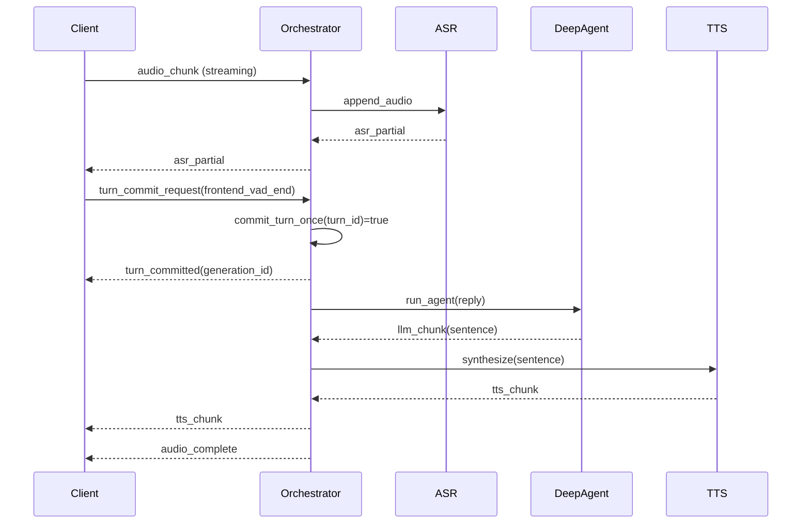
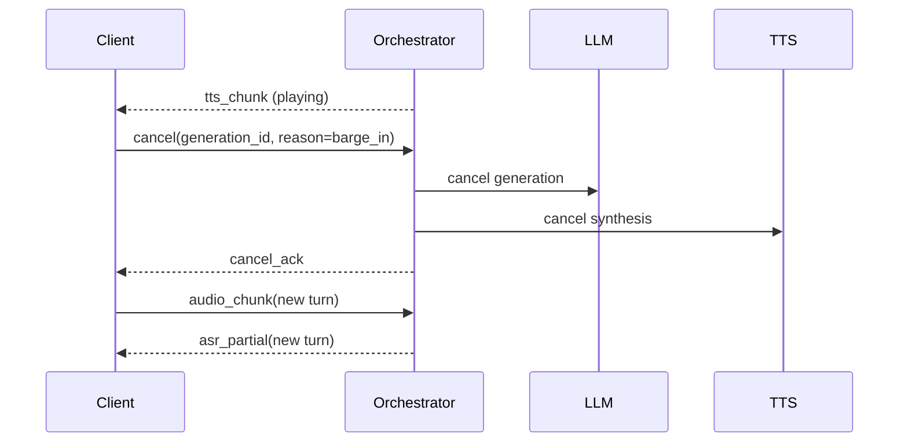

# 实时语音机器人协议与时序（Production）

## 1. 目标与范围

- 本文定义前后端在语音会话中的 WebSocket 事件协议、幂等规则与关键时序。
- 架构范围：前端采集 + WebSocket + 服务端编排 + ASR/LLM/TTS 级联链路。

## 2. 协议设计原则

- **统一主键**：每条消息必须携带 `session_id`、`turn_id`、`trace_id`。
- **顺序控制**：同一 `turn_id` 内通过 `seq` 做乱序检测。
- **幂等提交**：同一 `turn_id` 只能 `commit` 成功一次。
- **可取消**：任何 `generation_id` 都必须支持显式取消。

## 3. 公共字段（所有事件必填）

```json
{
  "type": "string",
  "session_id": "string",
  "turn_id": "string",
  "seq": 1,
  "trace_id": "string",
  "timestamp_ms": 1715673600000
}
```

## 4. 上行事件（Client -> Server）

### 4.1 `audio_chunk`

```json
{
  "type": "audio_chunk",
  "session_id": "s_001",
  "turn_id": "t_001",
  "seq": 12,
  "trace_id": "tr_abc",
  "timestamp_ms": 1715673601000,
  "audio_base64": "....",
  "codec": "pcm_s16le",
  "sample_rate_hz": 16000,
  "channels": 1,
  "chunk_ms": 100
}
```

### 4.2 `vad_event`

```json
{
  "type": "vad_event",
  "session_id": "s_001",
  "turn_id": "t_001",
  "seq": 33,
  "trace_id": "tr_abc",
  "timestamp_ms": 1715673602500,
  "event": "speech_end"
}
```

### 4.3 `turn_commit_request`

```json
{
  "type": "turn_commit_request",
  "session_id": "s_001",
  "turn_id": "t_001",
  "seq": 34,
  "trace_id": "tr_abc",
  "timestamp_ms": 1715673602800,
  "reason": "frontend_vad_end"
}
```

### 4.4 `cancel`

```json
{
  "type": "cancel",
  "session_id": "s_001",
  "turn_id": "t_001",
  "seq": 40,
  "trace_id": "tr_abc",
  "timestamp_ms": 1715673603500,
  "generation_id": "g_t_001",
  "reason": "barge_in"
}
```

## 5. 下行事件（Server -> Client）

### 5.1 `asr_partial` / `asr_final`

```json
{
  "type": "asr_partial",
  "session_id": "s_001",
  "turn_id": "t_001",
  "seq": 101,
  "trace_id": "tr_abc",
  "timestamp_ms": 1715673602000,
  "text": "我想查一下上个月",
  "stability": 0.78
}
```

```json
{
  "type": "asr_final",
  "session_id": "s_001",
  "turn_id": "t_001",
  "seq": 102,
  "trace_id": "tr_abc",
  "timestamp_ms": 1715673602900,
  "text": "我想查一下上个月那笔订单",
  "is_final": true
}
```

### 5.2 `turn_committed` / `turn_rejected`

```json
{
  "type": "turn_committed",
  "session_id": "s_001",
  "turn_id": "t_001",
  "seq": 103,
  "trace_id": "tr_abc",
  "timestamp_ms": 1715673603000,
  "generation_id": "g_t_001"
}
```

```json
{
  "type": "turn_rejected",
  "session_id": "s_001",
  "turn_id": "t_001",
  "seq": 104,
  "trace_id": "tr_abc",
  "timestamp_ms": 1715673603050,
  "error_code": "ALREADY_COMMITTED",
  "message": "turn already committed"
}
```

### 5.3 `llm_chunk` / `tts_chunk` / `audio_complete`

说明：`llm_chunk` 由服务端 DeepAgent（LangChain 智能体）执行结果流式产出。

```json
{
  "type": "llm_chunk",
  "session_id": "s_001",
  "turn_id": "t_001",
  "seq": 120,
  "trace_id": "tr_abc",
  "timestamp_ms": 1715673603600,
  "generation_id": "g_t_001",
  "text": "好的，我来帮你查一下。"
}
```

```json
{
  "type": "tts_chunk",
  "session_id": "s_001",
  "turn_id": "t_001",
  "seq": 130,
  "trace_id": "tr_abc",
  "timestamp_ms": 1715673603800,
  "generation_id": "g_t_001",
  "audio_base64": "....",
  "chunk_index": 0
}
```

```json
{
  "type": "audio_complete",
  "session_id": "s_001",
  "turn_id": "t_001",
  "seq": 150,
  "trace_id": "tr_abc",
  "timestamp_ms": 1715673604800,
  "generation_id": "g_t_001"
}
```

## 6. 关键时序图

### 6.1 正常流程



### 6.2 打断流程



## 7. 参考实现（Python，幂等提交）

```python
from dataclasses import dataclass, field
from threading import Lock
from typing import Optional


@dataclass
class turn_state:
    turn_id: str
    committed: bool = False
    generation_id: Optional[str] = None
    lock: Lock = field(default_factory=Lock)


def commit_turn_once(state: turn_state) -> bool:
    with state.lock:
        if state.committed:
            return False
        state.committed = True
        state.generation_id = f"g_{state.turn_id}"
        return True
```

## 8. 错误码建议

- `ALREADY_COMMITTED`：同轮重复提交
- `INVALID_STATE`：状态机不允许当前事件
- `ASR_NOT_READY`：ASR 尚未就绪
- `GENERATION_NOT_FOUND`：取消目标不存在
- `INTERNAL_ERROR`：服务端内部错误
